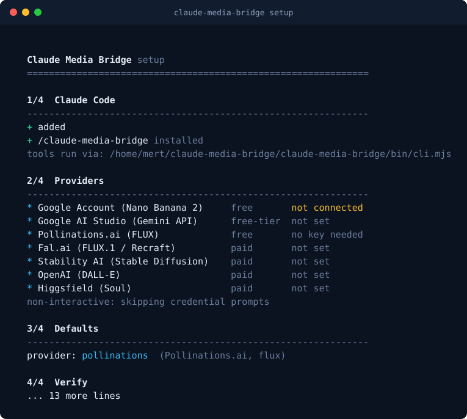
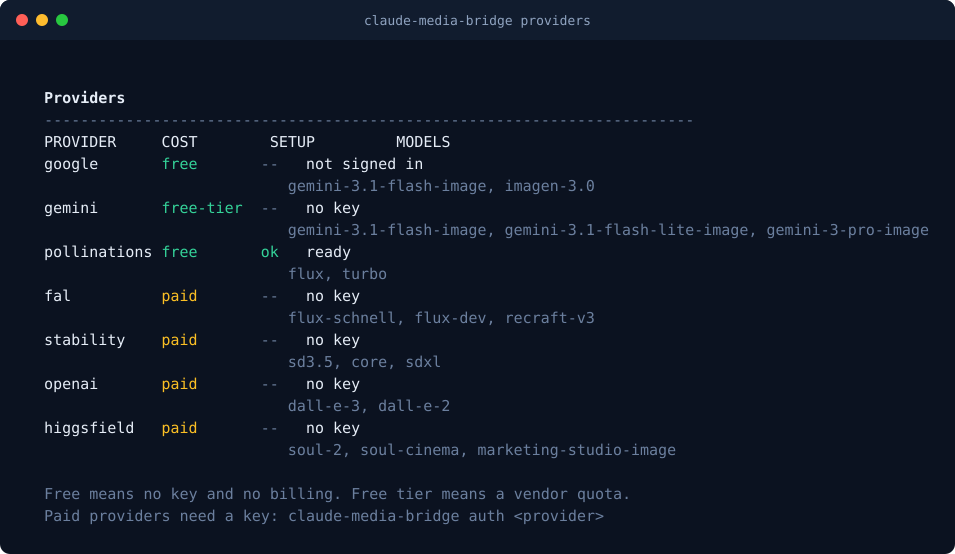
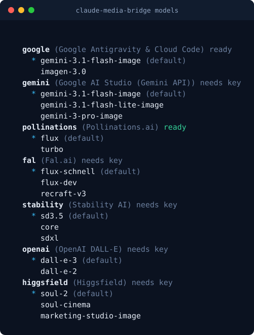
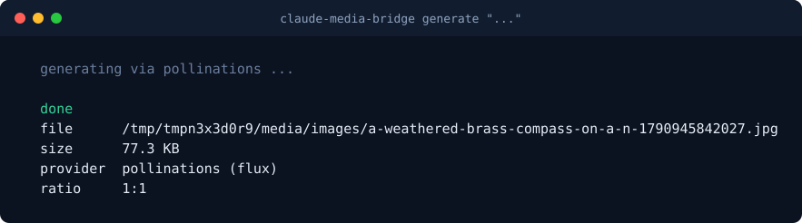
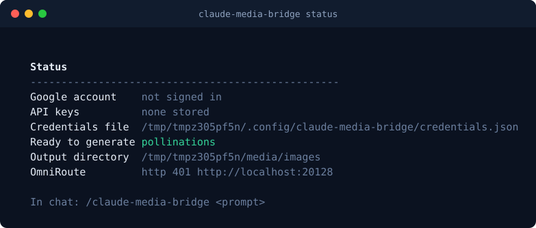

<div align="center">


# Claude Media Bridge

**Generate images from your chat. Sign in to Google with one click, get Nano Banana 2 for free.**

[](package.json)
[](LICENSE)
[](https://modelcontextprotocol.io)
[](#providers)
[](#requirements)

</div>

---

## Install

```bash
curl -fsSL https://raw.githubusercontent.com/mertgoevse-wq/claude-media-bridge/main/install.sh | bash
```

That clones, builds, links `claude-media-bridge` onto your PATH and runs setup.

<details>
<summary>Manual install</summary>

```bash
git clone https://github.com/mertgoevse-wq/claude-media-bridge.git ~/.local/share/claude-media-bridge
cd ~/.local/share/claude-media-bridge
npm install
npm run build
node bin/cli.mjs setup
```
</details>

---

## One-time setup

```bash
claude-media-bridge setup
```



Setup is safe to re-run. It registers the MCP server, installs the
`/claude-media-bridge` command, and walks you through connecting a provider. For
Google it opens a browser and completes the sign-in over loopback, so there is
no API key to copy anywhere.

Prefer clicking over typing? Open the same thing in a browser:

```bash
claude-media-bridge setup --web
```



---

## Use it in chat

Once setup has run, `/claude-media-bridge` is available in Claude Code:

```
/claude-media-bridge nano-banana a weathered brass compass on a nautical chart, soft window light
```

The first word picks the model or provider, the rest is the prompt. If you leave
it out, the configured default is used.

```
/claude-media-bridge                      # what is ready, and what to do next
/claude-media-bridge setup                # run setup from chat
/claude-media-bridge models               # every model you can request
/claude-media-bridge login                # connect your Google account
/claude-media-bridge connect              # connect a key-based provider
/claude-media-bridge soul-2 a ceramic mug on a workbench
```



### As a plugin

The repository is also a Claude Code plugin marketplace:

```bash
/plugin marketplace add mertgoevse-wq/claude-media-bridge
/plugin install media-bridge@claude-media-bridge
```

Configure the default provider and model in `/plugin` under **Configure**.

---

## Showcase

Generated with this bridge.

<div align="center">

| | |
| :---: | :---: |
|  |  |
|  |  |

</div>

---

## Providers

Cost labels are literal. *Free* means no key and no billing. *Free tier* means a
quota you can exhaust. *Paid* means you are billed per generation.

| Provider | Model | Auth | Cost |
| :--- | :--- | :--- | :--- |
| **Google Account** | `gemini-3.1-flash-image` (Nano Banana 2) | One-click sign-in | **Free** |
| **Google AI Studio** | `gemini-3.1-flash-image`, `gemini-3-pro-image` | Free API key | **Free tier** |
| **Pollinations** | `flux`, `turbo` | None | **Free**, throttled |
| **Fal.ai** | `flux-schnell`, `flux-dev`, `recraft-v3` | API key | Paid |
| **Stability AI** | `sd3.5`, `sdxl`, `core` | API key | Paid |
| **OpenAI** | `dall-e-3` | API key | Paid |
| **Higgsfield** | `soul-2`, `soul-cinema` | API key | Paid, no free tier |

### A note on the free paths

Both genuinely free routes need one step from you, and it is a short one:

- **Google Account sign-in** needs no key and no billing. This is the best free
  option.
- **Google AI Studio** gives you a free API key at
  [aistudio.google.com/apikey](https://aistudio.google.com/apikey). Nano Banana 2
  stays inside the free tier; Nano Banana Pro is billed.

**Pollinations is not a guarantee.** Its keyless tier is heavily rate limited and
frequently answers `402` instead of an image. The bridge retries five times with
backoff, which helps, but treat it as a backup. Sign in with Google if you need
images to just work.

---

## Command line

```bash
claude-media-bridge generate "a glass monolith at dusk" --ratio 16:9
claude-media-bridge generate "nordic fjord" --provider pollinations
claude-media-bridge generate "ceramic mug" --model soul-2
```





| Command | Purpose |
| :--- | :--- |
| `setup` | One-time setup. `--web` for the browser page, `--yes` for no prompts |
| `login` | Google sign-in, opens a browser |
| `auth <provider>` | Store an API key |
| `auth list` / `auth remove <provider>` | Inspect or delete stored keys |
| `status` | Auth state, ready providers, OmniRoute reachability |
| `providers` / `models` | What is available and what it costs |
| `generate <prompt>` | Generate an image |
| `uninstall` | Delete stored credentials and the MCP registration |

Keys are stored in `~/.config/claude-media-bridge/credentials.json` with `0600`
permissions. Nothing is printed to logs or transcripts.

---

## MCP tools

| Tool | Purpose |
| :--- | :--- |
| `generate_image` | Generate an image and return the file path |
| `connect_account` | Google sign-in or store an API key, from inside chat |
| `list_media_models` | Every provider and model with real cost and setup state |
| `run_setup` | Register the MCP server and report what is missing |
| `check_media_capabilities` | Full capability report |

`generate_image` accepts `prompt`, `provider`, `model`, `aspect_ratio`,
`filename`, `output_dir`, `sync_to_gallery` and `open_in_gallery`.

---

## OmniRoute

Optional and fully decoupled. If OmniRoute is running the bridge reports it in
`status`; if it is not, nothing breaks. Generation routes to providers directly.

---

## How it works

```
Claude Code  ──▶  /claude-media-bridge  ──▶  MCP server  ──▶  provider router
                                                                   │
                        ┌──────────────────────┬─────────────────────┤
                        ▼                      ▼                     ▼
                Google Account          Google AI Studio      Pollinations (free)
                (Nano Banana 2)         (Nano Banana 2/Pro)   (throttled fallback)
                                                                  + Fal, Stability,
                                                                    OpenAI, Higgsfield
                        └──────────────────────┴─────────────────────┘
                                           │
                                           ▼
                            ~/media/images/  ──▶  Android gallery
```

Images are written to `~/media/images/` by default. On Android they are copied
into `/sdcard/Pictures/` and the media scanner is triggered.

---

## Requirements

- Node.js 20 or newer
- Linux, macOS, or Android with Termux
- A browser, for Google sign-in

---

## Development

```bash
npm install
npm run build
npm test          # 50 tests
npm run typecheck
npm run screenshots
```

---

## License

MIT © 2026 Mert Gövse. See [LICENSE](LICENSE).