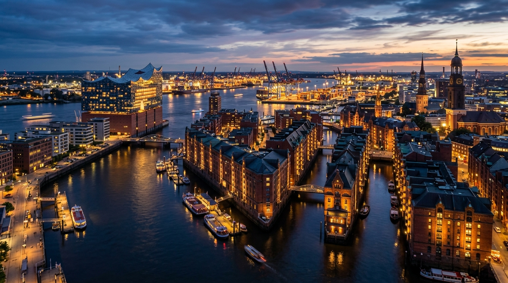
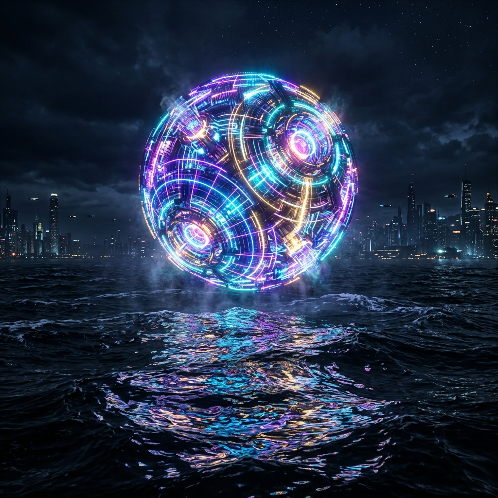

<div align="center">


# Claude Media Bridge

**Zero-config Media Generation MCP Bridge for Claude Code, Antigravity (AGY) & OmniRoute**

[](LICENSE)
[](#requirements)
[](https://modelcontextprotocol.io)
[](#architecture)

</div>

---

## Overview

`claude-media-bridge` is a Model Context Protocol (MCP) server that empowers **Claude Code** (running with Google's Antigravity `agy/gemini-3.8-flash-high` or any model) to generate photorealistic images via Google's **Nano Banana 2** (`gemini-3.1-flash-image`) — **without requiring a separate Gemini API key**.

It bridges Claude Code to a local [OmniRoute](https://github.com/danny-avila/LibreChat) instance, leveraging your existing Google Cloud Code / Antigravity OAuth session. Generated media is saved directly to disk as real files, passing the exact file path back to Claude Code for inspection, transformation, and pair-programming workflows.

Built specifically for mobile & workstation environments, including **Debian in Termux (Android PRoot)**, desktop Linux, and server setups. Ready for downstream integration into projects like `claude-code-android`, `droidroute`, and `flylab`.

---

## Gallery (Generated via AGY & Nano Banana 2)

All sample images below were generated in real-time through `claude-media-bridge` using Antigravity OAuth credentials on a Samsung Galaxy A56 (Termux/PRoot):

<div align="center">

| Hamburg Twilight Panorama (4K UHD) | Cybernetic Neon Artifact |
| :---: | :---: |
|  |  |
| *Aspect ratio 16:9 • Elbphilharmonie & Speicherstadt* | *Aspect ratio 1:1 • Photorealistic 8K render* |

</div>

---

## Architecture

```
┌─────────────────────────────────────────────────────────────┐
│                    Claude Code CLI / IDE                    │
│           (e.g., cc-omni --model agy/gemini-3.8)            │
└──────────────────────────────┬──────────────────────────────┘
                               │  stdio (MCP)
                               ▼
┌─────────────────────────────────────────────────────────────┐
│                     claude-media-bridge                     │
│               (~/.local/bin/claude-media-bridge)            │
└──────────────────────────────┬──────────────────────────────┘
                               │  HTTP /v1/images/generations
                               ▼
┌─────────────────────────────────────────────────────────────┐
│                    OmniRoute Local Server                   │
│                    (http://localhost:20128)                 │
└──────────────────────────────┬──────────────────────────────┘
                               │  Google Cloud Code OAuth
                               ▼
┌─────────────────────────────────────────────────────────────┐
│             Google Antigravity Upstream Backend             │
│            daily-cloudcode-pa.googleapis.com                │
│         (Nano Banana 2 / gemini-3.1-flash-image)            │
└─────────────────────────────────────────────────────────────┘
```

---

## Key Features

- **Zero Gemini API Key Needed**: Uses the active Antigravity/AGY Google OAuth credentials already present in OmniRoute.
- **Real Files on Disk**: Decodes and writes JPEG/PNG files to `~/media/images/` (or custom directory) and returns absolute file paths, keeping LLM context windows lean.
- **Full Agent Autonomy**: Claude Code can immediately invoke the `Read` tool on the resulting path to verify or visually analyze the output.
- **Android / Termux Integration**: Generated media can be synced into internal storage (`/sdcard/Pictures/`) and opened in native Android galleries via intent broadcast.
- **Fast Standalone Bundle**: Compiled into a lightweight self-contained ESM bundle via `bun build`.

---

## Installation & Setup

### 1. Prerequisites

- Node.js (>= 18) or Bun (>= 1.2)
- An active OmniRoute instance with a configured Antigravity/AGY provider connection (default port `20128`)

### 2. Global Installation

Clone and install into your local share directory:

```bash
git clone https://github.com/mertgoevse-wq/claude-media-bridge.git ~/.local/share/claude-media-mcp
cd ~/.local/share/claude-media-mcp
npm install
npm run build
ln -sf ~/.local/share/claude-media-mcp/bin/cli.mjs ~/.local/bin/claude-media-bridge
```

### 3. Register as Global Claude Code MCP

Add to your global user scope so it is available across all projects:

```bash
claude mcp add -s user media-bridge -- claude-media-bridge
```

Verify connection:

```bash
claude mcp list
```

---

## Available Tools

### `generate_image`

Generates an image via Nano Banana 2 (`gemini-3.1-flash-image`) and writes it to disk.

| Parameter | Type | Required | Description |
| :--- | :--- | :--- | :--- |
| `prompt` | `string` | **Yes** | Detailed image prompt. |
| `filename` | `string` | No | Base filename (without extension). |
| `output_dir` | `string` | No | Target folder (defaults to `~/media/images`). |
| `aspect_ratio` | `enum` | No | `"1:1"`, `"16:9"`, `"9:16"`, `"4:3"`, `"3:4"` (default: `"1:1"`). |

### `generate_video`

Probes video generation capability. Because Google Cloud Code OAuth does not include Veo endpoints, returns an actionable diagnostic explaining requirements for video tasks.

### `generate_music`

Probes music generation capability. Returns a diagnostic explaining Vertex AI / Lyria requirements.

### `check_media_capabilities`

Returns JSON status of the OmniRoute connection, active AGY credentials, and supported media models.

---

## Claude Code Slash Command & Skill

A custom skill is available under `~/.claude/skills/media/SKILL.md`. You can trigger media generation via:

- `/media` in chat, or
- Natural language instructions like: *"Generate a cinematic aerial photo of Hamburg harbor in 16:9"*.

---

## License

MIT © [Mert Gövse](https://github.com/mertgoevse-wq)
