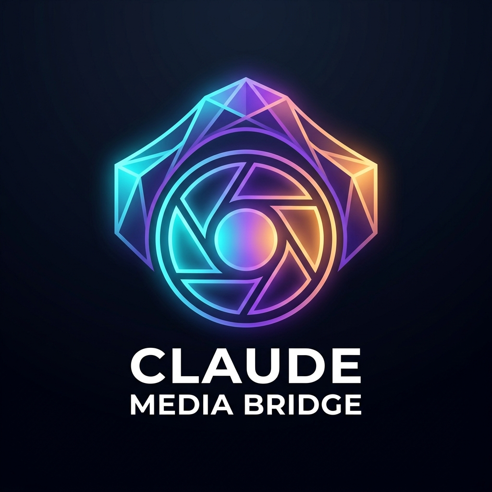
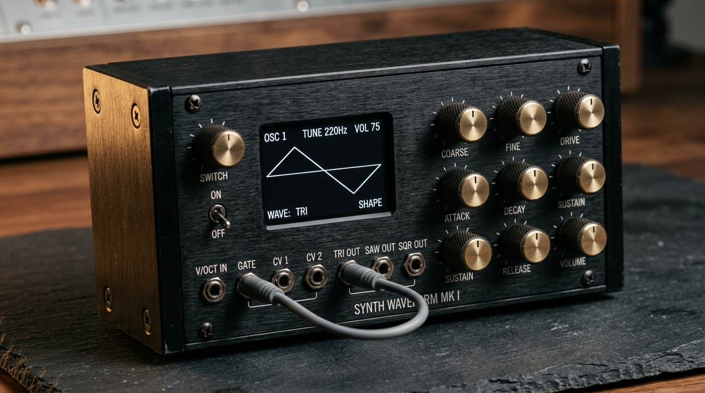
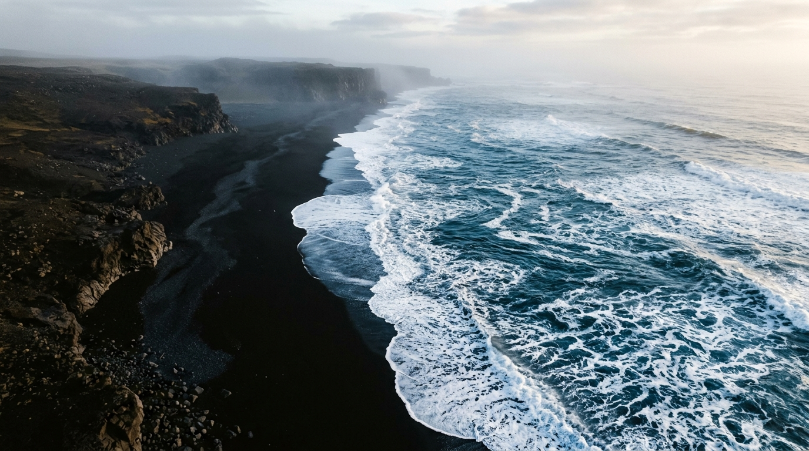
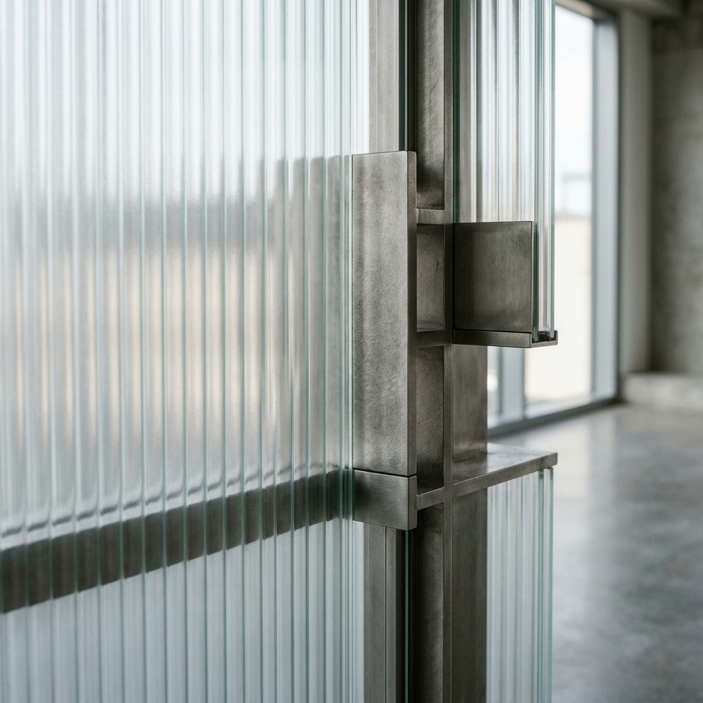

<div align="center">




# Claude Media Bridge

**Universal Media Generation MCP Bridge for Claude Code, Antigravity & Multi-Provider AI**  
*Direct Google Account OAuth, zero-key free tiers (Pollinations FLUX), and professional provider routing (OpenAI, Stability, Fal.ai) — built for developers and autonomous agentic workflows.*

[](package.json)
[](LICENSE)
[](https://modelcontextprotocol.io)
[](#supported-providers)
[](#requirements)

</div>

---

## ⚡ What is Claude Media Bridge?

`claude-media-bridge` is a standalone, multi-provider Model Context Protocol (MCP) server that empowers **Claude Code** (and any MCP client) to generate photorealistic images directly into local workspace files — without complex proxies or paid gateways.

### 🌟 Key Highlights:
- **No External Proxy Required:** Completely decoupled from OmniRoute. Works out-of-the-box as an independent binary.
- **Direct Google Account OAuth:** Run `claude-media-bridge login` to authenticate with your personal Google account. Generates images via **Google's Nano Banana 2 (`gemini-3.1-flash-image`)** through Cloud Code internal endpoints with zero API fees.
- **Zero-Key Free Tier (Pollinations FLUX):** If no Google account or API keys are configured, it automatically falls back to **Pollinations.ai (FLUX / Turbo)** for 100% free, instant image generation with zero configuration.
- **Professional Provider Routing:** Seamlessly supports **OpenAI (DALL-E 3)**, **Stability AI (SD 3.5 / SDXL)**, and **Fal.ai (FLUX.1 Schnell & Dev, Recraft v3)** whenever respective API keys are present.
- **Real Files on Disk:** Writes full-resolution JPEG/PNG files to `~/media/images/` and returns absolute file paths to Claude Code for immediate inspection, editing, and pair programming.
- **Android & Termux Integration:** Automatically synchronizes images to Android `/sdcard/Pictures/` and triggers native Android media scanner broadcasts.

---

## 🎨 Visual Showcase (Generated via Nano Banana 2)

All images below were generated live with `claude-media-bridge` using personal Google account authentication:

<div align="center">

| **1. Industrial Audio Synthesizer** (16:9) | **2. Arctic Volcanic Coastline** (16:9) |
| :---: | :---: |
|  |  |
| *Brushed aluminum, knurled knobs, OLED waveform display* | *Top-down aerial surf, basalt sand, atmospheric mist* |

| **3. Architectural Glass & Titanium** (1:1) | **4. Artisan Ceramicist Portrait** (4:3) |
| :---: | :---: |
|  |  |
| *Macro fluted glass, brushed titanium, natural daylight* | *Natural window light, clay splatters, Kodachrome film tone* |

</div>

> **Anti-AI-Slop Guarantee:** Clean compositions, authentic physical textures, realistic lighting falloff, and crisp typography without generic neon mush or plastic skin artifacts.

---

## 🔌 Supported Providers

Inspect all available providers anytime with `claude-media-bridge providers`:

| Provider | Default Model | Auth Requirement | Cost |
| :--- | :--- | :--- | :--- |
| **Google Antigravity** | `gemini-3.1-flash-image` (Nano Banana 2) | Google Account (`claude-media-bridge login`) | **Free** (No Gemini API key needed) |
| **Pollinations.ai** | `flux` | None (Zero-config instant fallback) | **100% Free** (No API key needed) |
| **OpenAI** | `dall-e-3` | `OPENAI_API_KEY` | Paid OpenAI Account |
| **Stability AI** | `sd3.5` / `sdxl` | `STABILITY_API_KEY` | Paid Stability Account |
| **Fal.ai** | `flux-schnell` / `recraft-v3` | `FAL_KEY` | Paid Fal Account |

---

## 🏗️ Architecture

```
┌────────────────────────────────────────────────────────────────────────┐
│                        Claude Code / Agent CLI                         │
└───────────────────────────────────┬────────────────────────────────────┘
                                    │ Stdio Transport (MCP)
┌───────────────────────────────────▼────────────────────────────────────┐
│                          claude-media-bridge                           │
│                                                                        │
│  ┌──────────────────────────────────────────────────────────────────┐  │
│  │                    Smart Provider Router                         │  │
│  │     (Explicit -> Requested Model -> Priority Chain -> Free)      │  │
│  └──────────────────┬──────────────┬──────────────┬─────────────┬───┘  │
│                     │              │              │             │      │
│          ┌──────────▼───┐   ┌──────▼─────┐   ┌────▼─────┐  ┌────▼────┐ │
│          │    Google    │   │   OpenAI   │   │Stability │  │  Fal.ai │ │
│          │  Nano Banana │   │  DALL-E 3  │   │  SD 3.5  │  │  FLUX.1 │ │
│          └──────────┬───┘   └────────────┘   └──────────┘  └─────────┘ │
│                     │                                                  │
│                     │ (Zero-Key Instant Fallback)                      │
│                     ▼                                                  │
│          ┌──────────────────────────────────────────────────────────┐  │
│          │         Pollinations.ai (Free FLUX / Turbo)              │  │
│          └──────────────────────────────────────────────────────────┘  │
└───────────────────────────────────┬────────────────────────────────────┘
                                    │ Saves to ~/media/images/
                                    ▼
┌────────────────────────────────────────────────────────────────────────┐
│             Filesystem + Android Gallery Media Scanner                 │
└────────────────────────────────────────────────────────────────────────┘
```

---

## 🚀 Quick Start

### 1. Installation

```bash
git clone https://github.com/mertgoevse-wq/claude-media-bridge.git ~/.local/share/claude-media-mcp
cd ~/.local/share/claude-media-mcp
npm install
npm run build
ln -sf ~/.local/share/claude-media-mcp/bin/cli.mjs ~/.local/bin/claude-media-bridge
```

### 2. Connect Your Account (Optional but Recommended)

For Google's Nano Banana 2:
```bash
claude-media-bridge login
```
*(If you skip this step, the bridge automatically uses the free Pollinations FLUX tier!)*

Check status:
```bash
claude-media-bridge status
claude-media-bridge providers
```

### 3. Add to Claude Code

Add `claude-media-bridge` to your Claude Code configuration (`~/.claude.json`):

```json
{
  "mcpServers": {
    "media-bridge": {
      "command": "claude-media-bridge"
    }
  }
}
```

Now launch Claude Code. The tools are ready:

```
> "Generate a photorealistic studio photo of a sleek obsidian mechanical keyboard with amber backlighting"
```

---

## 🛠️ CLI Reference

`claude-media-bridge` includes a complete CLI for testing, account management, and automation:

| Command | Description |
| :--- | :--- |
| `claude-media-bridge` | Default: starts MCP server over Stdio (for Claude Code). |
| `claude-media-bridge login` | Start interactive Google OAuth flow. |
| `claude-media-bridge status` | Check authentication state, Google project ID, and active capabilities. |
| `claude-media-bridge providers` | List all 5 supported providers and their configuration status. |
| `claude-media-bridge logout` | Delete stored credentials from `~/.config/claude-media-bridge/`. |
| `claude-media-bridge generate "<prompt>"` | Generate an image directly from the command line. |
| `claude-media-bridge help` | Print usage help. |

### CLI Image Generation Examples:

```bash
# Default (auto-routes to Google Nano Banana or Pollinations FLUX)
claude-media-bridge generate "A dramatic Nordic fjord at dusk" --ratio 16:9

# Force specific provider or model
claude-media-bridge generate "Abstract frosted glass monolith" --provider pollinations --ratio 1:1
claude-media-bridge generate "Cybernetic architectural detail" --provider openai --ratio 1:1
```

---

## 🧩 MCP Tools Reference

When connected to Claude Code, `claude-media-bridge` provides:

### `generate_image`
Generates high-fidelity images using the optimal configured provider.
- `prompt` *(string, required)*: Detailed description of the image.
- `provider` *(enum, optional)*: `"auto"` | `"google"` | `"pollinations"` | `"openai"` | `"stability"` | `"fal"`.
- `model` *(string, optional)*: Specific model to request (e.g. `gemini-3.1-flash-image`, `flux`, `dall-e-3`, `sd3.5`).
- `aspect_ratio` *(enum, optional)*: `"1:1"` | `"16:9"` | `"9:16"` | `"4:3"` | `"3:4"`.
- `filename` *(string, optional)*: Custom output filename.
- `output_dir` *(string, optional)*: Directory where the image will be saved (default: `~/media/images`).
- `sync_to_gallery` *(boolean, optional)*: Auto-sync image to Android `/sdcard/Pictures/` and trigger media scanner (default: `true`).
- `open_in_gallery` *(boolean, optional)*: Open image in device viewer (default: `false`).

### `check_media_capabilities`
Returns a structured JSON summary of configured providers, authentication status, and available models.

---

## 🔒 Security & Privacy

- **Safe Credential Storage:** Credentials are saved in `~/.config/claude-media-bridge/credentials.json` with restricted `0600` POSIX file permissions.
- **Zero Secret Logging:** Tokens and API keys are never printed to terminal transcripts or execution logs.
- **Direct Local TLS:** Requests travel directly from your machine to upstream APIs over encrypted TLS.

---

## 📄 License

MIT License © 2026 Mert Gövse. See [LICENSE](LICENSE) for details.
